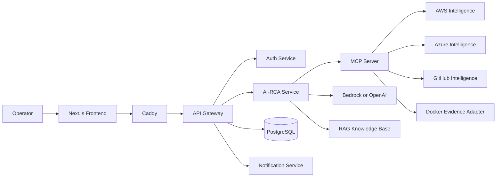

# ResolveOps AI — Project Documentation

## 1. Project Overview

ResolveOps AI is an evidence-first incident investigation and Root Cause Analysis (RCA) platform for cloud and containerized environments. It gives operations teams a single interface for asking questions about incidents, services, deployments, infrastructure health, logs, metrics, costs, and reliability.

The platform combines live operational telemetry with AI-assisted analysis. Instead of asking an operator to search several consoles and repositories manually, ResolveOps AI coordinates the relevant evidence sources and presents the findings as a structured explanation, RCA response, table, chart, or architecture visual.

The current deployment model is a Docker Compose application hosted on an AWS EC2 instance. The design is service-oriented so that authentication, API routing, evidence integrations, AI orchestration, persistence, notifications, and the user interface can evolve independently.

## 2. Problem Statement

Incident response is often slowed by fragmented information and inconsistent investigation practices:

- Logs, metrics, cloud events, deployment history, and container state live in different systems.
- Operators spend valuable time collecting context before they can reason about a failure.
- Manual correlation makes it easy to miss the relationship between a deployment, a resource event, and a service symptom.
- AI responses can be unreliable when they are not grounded in current telemetry.
- Different engineers may produce different investigation results because the process is not standardized.
- Remediation advice can create operational risk when the evidence is incomplete or permissions are too broad.

ResolveOps AI addresses this problem by providing a common, evidence-backed workflow for operational investigation while keeping the analysis path read-only.

## 3. Aim and Objectives

### Aim

To reduce the time and uncertainty involved in cloud incident investigation by correlating operational evidence and presenting an explainable, structured analysis.

### Objectives

1. Provide one interface for incident and infrastructure questions.
2. Collect relevant evidence from supported cloud, source-control, and container systems.
3. Correlate live evidence with historical incident knowledge where configured.
4. Generate concise RCA reports with confidence and evidence limitations.
5. Prevent unsupported claims, fabricated identifiers, and unsafe infrastructure actions.
6. Preserve request IDs, tool-call status, and execution metadata for traceability.
7. Support architecture explanations and visual responses in addition to plain text.

## 4. Requirement Analysis

### 4.1 Functional requirements

| ID | Requirement | Solution coverage |
|---|---|---|
| FR-01 | Users must authenticate before using protected operations. | Authentication and authorization are handled at the gateway and auth service. |
| FR-02 | Users must be able to ask natural-language operational questions. | The frontend sends chat and investigation requests through the API gateway. |
| FR-03 | Users must be able to investigate an incident or service. | The AI-RCA orchestrator accepts an incident ID, service, question, and time window. |
| FR-04 | The system must collect evidence from multiple sources. | MCP tools route requests to AWS, Azure, GitHub, Docker, and incident services. |
| FR-05 | The system must return an understandable RCA. | Responses include summary, probable cause, confidence, impact, recommendations, and evidence warnings. |
| FR-06 | The system must support insufficient or unavailable evidence. | Tool failures are isolated and unavailable evidence sources are reported. |
| FR-07 | The system must support operational visuals. | Intent classification and visual planning support diagrams, charts, tables, and generated images. |
| FR-08 | The system must provide traceability. | Request IDs, investigation IDs, tool calls, durations, and execution metadata are returned. |
| FR-09 | The system must avoid unauthorized changes. | Investigation tooling is read-only; remediation actions are outside the RCA path. |

### 4.2 Non-functional requirements

- **Security:** Use authenticated service boundaries, scoped credentials, secret redaction, and read-only access where possible.
- **Reliability:** A failure in one evidence source should not hide evidence from other sources.
- **Explainability:** AI output must be grounded in collected evidence and must identify uncertainty.
- **Performance:** Independent evidence calls should be performed concurrently and tool calls should be bounded.
- **Maintainability:** Integrations should be isolated behind services and MCP tools.
- **Observability:** Health checks, structured logs, request IDs, and execution metadata should support troubleshooting.
- **Portability:** The system should support AWS, Azure, Docker Compose, and Kubernetes-related operational contexts where integrations are configured.
- **Usability:** The interface should expose investigation progress, structured results, errors, and retry behavior clearly.

## 5. Proposed Solution

ResolveOps AI uses a layered microservice architecture:

1. **Frontend layer:** A Next.js application provides navigation, chat, incident investigation, analytics, service views, integrations, and visual result rendering.
2. **Gateway layer:** The API gateway authenticates requests, applies routing and policy, and exposes a stable API to the frontend.
3. **Orchestration layer:** The AI-RCA service classifies intent, coordinates MCP tool use, invokes the configured AI provider, and formats the result.
4. **Evidence layer:** The MCP server exposes controlled tools that call AWS, Azure, GitHub, Docker, incident, and service-health integrations.
5. **Persistence layer:** PostgreSQL stores application and incident data; mounted volumes store generated visuals and database state.
6. **Operations layer:** Caddy provides the external HTTP/HTTPS entry point, while Docker Compose manages service networking, startup dependencies, health checks, and restarts.

The central design decision is to separate **evidence collection** from **reasoning**. Integrations return structured evidence, and the model receives that evidence through a controlled orchestration path rather than directly accessing infrastructure.

## 6. Technology Stack

| Area | Technology | Role |
|---|---|---|
| User interface | Next.js, React, JavaScript | Web application and result visualization |
| Backend services | Python, FastAPI-style HTTP services | APIs, integrations, orchestration, and domain services |
| AI | Amazon Bedrock as the primary provider; OpenAI-compatible provider support | Natural-language analysis, chat, classification, and visual planning |
| Tool protocol | Model Context Protocol (MCP) | Controlled discovery and execution of operational evidence tools |
| Database | PostgreSQL 15 Alpine | Users, incidents, operational records, and related application data |
| Deployment | Docker, Docker Compose | Packaging, service isolation, networking, and local/EC2 operation |
| Edge proxy | Caddy | HTTP/HTTPS termination and routing |
| Cloud integrations | AWS APIs, Azure APIs, CloudWatch, CloudTrail, Azure Monitor | Infrastructure and telemetry evidence |
| Source control | GitHub API and GitHub Actions data | Repository and deployment evidence |
| Container integration | Docker Engine API through a read-only evidence adapter | Container state, logs, and service evidence |
| Storage | Docker named volumes and mounted data directory | PostgreSQL data and generated visual artifacts |

## 7. High-Level Architecture



The diagram is a conceptual view. Detailed deployment, integration, authentication, and data-flow diagrams are maintained in the numbered documents in this directory.

## 8. Methods Used to Achieve the Solution

### 8.1 Evidence-first investigation

The system starts with the user's question, incident ID, or service name. It collects relevant evidence before asking the AI provider to explain the situation. Evidence items include a source, resource, type, timestamp, summary, citation, and optional raw preview.

### 8.2 MCP-based tool orchestration

The AI-RCA service discovers available MCP tools and runs a bounded agent loop. The model can request a tool, the MCP server executes it, and the result is appended to the conversation for further reasoning. Tool calls record success, failure, inputs, duration, and error codes.

### 8.3 Concurrent evidence collection

Independent evidence sources can be queried concurrently. Each call has individual error isolation, so a failed CloudWatch, GitHub, Docker, or incident lookup does not automatically discard successful results from other sources.

### 8.4 Retrieval-augmented context

Where configured, the platform retrieves historical incident and operational knowledge to provide context beyond the current time window. Historical context complements live evidence; it does not replace it.

### 8.5 Guardrailed AI reasoning

System prompts constrain the assistant to operational topics, require evidence-based conclusions, prohibit fabricated workflow details and placeholders, and prohibit recommendations that modify, restart, scale, or delete infrastructure. The chat path also rejects clearly out-of-scope questions.

### 8.6 Structured response generation

RCA results are normalized into predictable fields. Chat intent classification routes requests to text, code, table, chart, Mermaid, structured diagram, or image workflows. Visual responses carry a matching explanation and a machine-readable visual specification.

### 8.7 Graceful degradation

The platform returns explicit error metadata for provider failures, reports insufficient evidence when appropriate, falls back to plain text when structured parsing fails, and can fall back from generated images to interactive structured diagrams.

## 9. Working of the Solution

### 9.1 RCA investigation flow

1. The operator submits an investigation request containing an incident ID, service, question, and time window.
2. The API gateway authenticates and forwards the request to the AI-RCA service.
3. The orchestrator creates request and investigation IDs for traceability.
4. The investigation prompt is sent to the AI provider with the RCA system rules and available MCP tools.
5. The model selects relevant read-only tools.
6. The MCP server invokes the appropriate integration service.
7. Tool results are converted into evidence items and returned to the model.
8. The model correlates the evidence and produces structured RCA JSON.
9. The service returns the RCA, evidence, tool statuses, duration, and execution metadata to the gateway.
10. The frontend renders the result and exposes warnings or retryable errors to the operator.

### 9.2 Chat and visual flow

1. The user submits a natural-language operational question.
2. The domain guardrail checks whether the question is relevant to infrastructure and operations.
3. An intent classifier identifies the response type.
4. Text-like operational questions may use MCP-assisted chat; non-operational questions are rejected.
5. Visual intents are converted into a validated visual specification.
6. The selected renderer creates a structured diagram, Mermaid response, chart/table response, or generated image.
7. A technical explanation is generated from the same specification so that text and visual content remain aligned.
8. The frontend renders the response using the appropriate result component.

### 9.3 Failure handling

Failures are handled at the narrowest useful boundary:

- Individual MCP failures are recorded without stopping other evidence collection.
- Provider failures are classified into a stable error response.
- Invalid AI JSON produces a plain-text fallback or an insufficient-evidence result.
- Image generation failures fall back to a structured diagram where possible.
- Request IDs allow operators and administrators to correlate frontend errors with service logs.

## 10. Security and Governance

The platform follows a least-privilege and read-only investigation model:

- Credentials are supplied through environment configuration or managed instance permissions rather than hardcoded in source code.
- AWS access is designed around an EC2 instance role.
- The Docker evidence adapter mounts the Docker socket read-only for evidence collection.
- The MCP server is an internal service boundary and requires its configured authentication token.
- User input handling includes client-side secret redaction behavior documented by the UI specification.
- AI prompts explicitly prohibit infrastructure-changing actions and unsupported claims.
- Audit and operational metadata provide accountability for requests and tool execution.

The separate remediation and approval features should remain isolated from the evidence-only RCA path and require their own authorization, audit, and approval controls.

## 11. Deployment and Operation

The reference deployment runs the services with Docker Compose. PostgreSQL health checks gate dependent services, internal services communicate over backend networks, and Caddy exposes the application at the edge. Generated visuals and database data use persistent volumes.

Typical operational steps are:

1. Configure environment variables and provider credentials.
2. Attach the required AWS IAM instance role and integration permissions.
3. Build and start the Compose services.
4. Verify service health endpoints and database readiness.
5. Sign in through the frontend and run a controlled test investigation.
6. Monitor logs, health checks, execution metadata, and provider usage.

See [EC2 Docker Compose Deployment](03-ec2-docker-compose-deployment.md), [Environment Variable Reference](14-environment-variable-reference.md), and [Operations Runbook](17-operations-runbook.md) for operational procedures.

## 12. Expected Benefits

- Faster initial incident triage.
- Less context switching between monitoring, cloud, source-control, and container tools.
- More consistent investigation structure across operators.
- Better separation between observed facts and uncertain conclusions.
- Easier review through evidence summaries, citations, confidence, and request metadata.
- A modular foundation for adding supported integrations without changing the user workflow.

## 13. Limitations and Future Enhancements

The quality of an RCA depends on the availability, freshness, permissions, and accuracy of the connected evidence sources. The AI provider can summarize and correlate evidence, but it cannot establish facts that were never collected. Provider outages, incomplete telemetry, incorrect credentials, and noisy logs can reduce confidence.

Potential future enhancements include richer historical correlation, stronger schema validation for provider output, distributed deployment for higher availability, deeper Kubernetes evidence coverage, configurable investigation policies, and separately governed approval-based remediation workflows.

## 14. Screenshots and Demonstration Evidence

Screenshots can be added later without changing the document structure. Recommended locations are:

### 14.1 Dashboard

`[Insert screenshot: ResolveOps AI dashboard and navigation]`

Caption: Main dashboard showing service status, navigation, and current operational context.

### 14.2 AI Copilot chat

`[Insert screenshot: AI Copilot conversation with an operational question]`

Caption: Natural-language operational question and evidence-backed assistant response.

### 14.3 RCA result

`[Insert screenshot: Structured RCA response with confidence and evidence]`

Caption: Investigation result showing summary, probable root cause, impact, recommendations, and evidence limitations.

### 14.4 Architecture visual

`[Insert screenshot: Generated or structured architecture diagram]`

Caption: Visual response generated from an infrastructure or network architecture question.

### 14.5 Analytics and integrations

`[Insert screenshot: Analytics page or integrations configuration]`

Caption: Operational analytics, provider status, or configured evidence integrations.

When images are available, place them in `docs/images/` and replace each placeholder with standard Markdown, for example:

```markdown

```

## 15. Documentation Map

- [Project Overview](01-project-overview.md)
- [Architecture and Request Flow](02-architecture-and-request-flow.md)
- [Deployment](03-ec2-docker-compose-deployment.md)
- [AI, cloud, source-control, and MCP integrations](05-amazon-bedrock-integration.md)
- [Database and incidents](12-database-and-incidents.md)
- [UI and chat behavior](16-ui-and-chat-behaviour.md)
- [Operations and troubleshooting](17-operations-runbook.md)
- [Analytics](19-analytics-page.md)